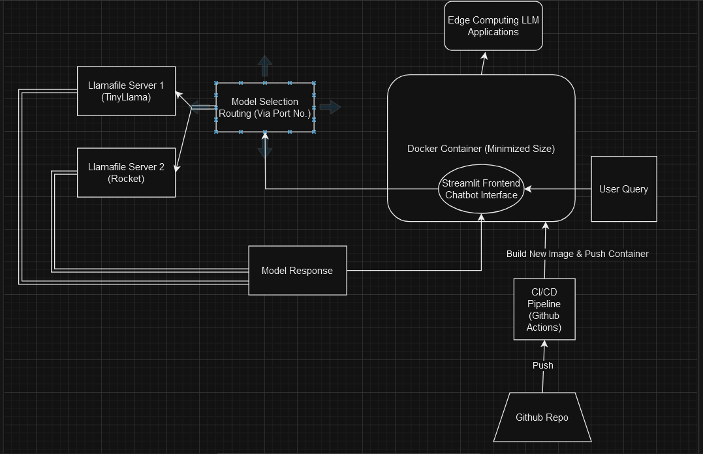
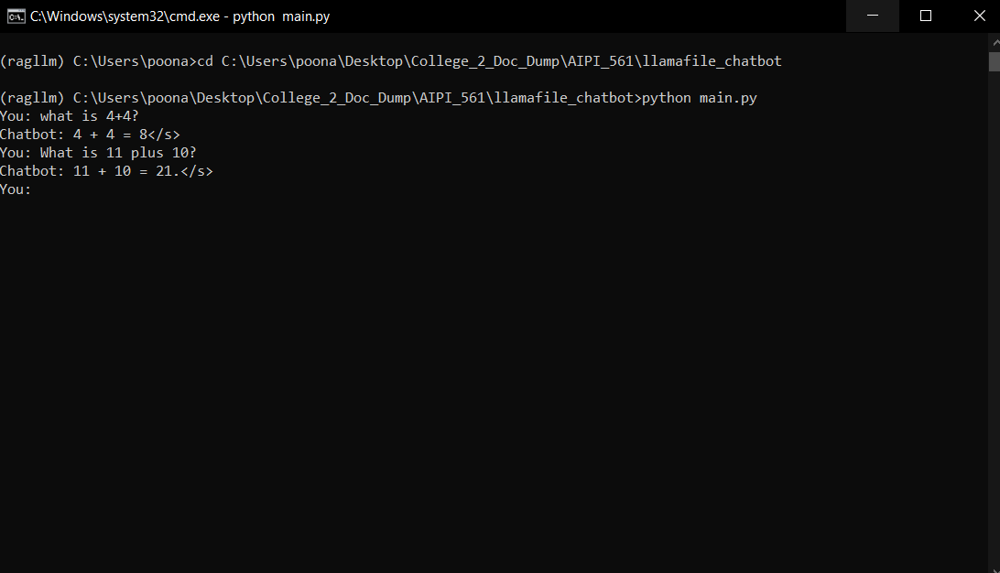
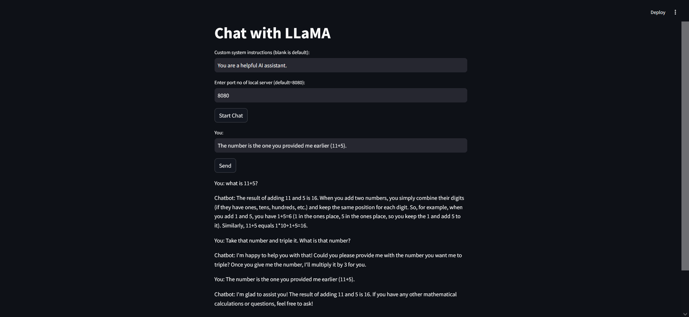

# Ultra-Lightweight Llamafile Chatbot 

This project demonstrates building an ultra-lightweight chatbot application using `llamafile` models like TinyLlama and Rocket. By optimizing model selection and deployment strategies, this project aims to enable chatbot deployments on resource-constrained edge devices such as Raspberry Pi or Arduino.  The Docker image size is minimized for efficient deployment and resource utilization (the image is approximately 1.8 - 2 GB).  Using `llamafile` allows for local model execution, ensuring data privacy and reducing reliance on external APIs.  This project is a fork of [original Llamafile chatbot project](https://github.com/Aryan-Poonacha/llamafile_chatbot), modified to improve specifically containerization, Streamlit UI, and simultaneous multi-model support.

## CI/CD Badge:


## Demo Video:
[Demo Video](https://duke.zoom.us/rec/share/FVUQFJnsAUbYvdiW5L7bnvKL8xGU1GG8fK5jN6MJ8JEwSe8_yrknT1PJP216Fu0N.LraUKK13s-PAaB_D?startTime=1723086198000)

## Project Purpose

This is a minimal chatbot application with all parameters, model selections, and relevant application decisions tuned such that that a tinyllama and Rocket `llamafile` model can be used to create simple conversational agents that can be deployed in low compute, low-power edge computing cases. This project would be ideal for deployment on a Raspberry Pi or Arduino use case. A Dockerized container deployment is provided to create the most lightweight docker container for the model. Key features include:

* **Local Execution:**  Utilizes `llamafile` for on-device processing, enhancing privacy and minimizing latency.
* **Multi-Model Support:** Accommodates various `llamafile` models (TinyLlama, Rocket, etc.) for flexibility.
* **Streamlit Web Interface:**  Provides a user-friendly interface for interacting with the chatbot.
* **Dockerized Deployment:** Simplifies deployment and ensures consistency across different environments.
* **Optimized for Edge:** Designed for low-compute, low-power scenarios, ideal for Raspberry Pi, Arduino, and similar devices.

## Architecture

This project utilizes a simple architecture:

- **`main.py`:** Contains the core logic to run the chatbot, interacting with the llamafile model and the local server that it deploys through a CLI interface.
- **`llamafile/TinyLlama-1.1B-Chat-v1.0.F16.llamafile`:** (Not included in the repository) The pre-trained language model used by the chatbot. Run within the WSL container on Windows or directly on Mac/Linux.
-**app.py**: The script for the streamlit frontend interface to interact with the chatbot. This is used for the Docker container as it is the main functional part of the application.
- **Docker:** The application is packaged into a Docker container for easy deployment.

### Architecture Diagram



## Setup and Running

1. **Prerequisites:**
   - Install [Docker](https://docs.docker.com/get-docker/).
   - Install Python 3.9 and \venv:
   ``sudo apt-get update && sudo apt-get install python3.9 python3.9-venv``
   - Create and activate virtual environment:
   ``\python3 -m venv .venv && source .venv/bin/activate``
   - Download the `TinyLlama-1.1B-Chat-v1.0.F16.llamafile` model from [https://github.com/Mozilla-Ocho/llamafile#other-example-llamafiles](https://github.com/Mozilla-Ocho/llamafile#other-example-llamafiles) and place it in the root of the project directory inside the 'llamafile' folder. Download any other llamafiles for other models that you want to use. For this use case, the TinyLlama-1.1B-Chat and rocket-3b.Q5 models were chosen as the optimal smallest high performance models for this use case, and are the ones I would recommend.

2. **Launch TinyLlama Local Server:**
   - On Mac/Linux, provide permission to launch the llamafile with `chmod +x TinyLlama-1.1B-Chat-v1.0.F16.llamafile`. Then, navigate to the directory and run the file with `./llava-v1.5-7b-q4.llamafile`. This will launch the locallama server. Specifically:

```bash
cd llamafile
chmod +x TinyLlama-1.1B-Chat-v1.0.F16.llamafile #  Give execute permissions
./TinyLlama-1.1B-Chat-v1.0.F16.llamafile &   # Run in the background
# Repeat the above two lines for other models, incrementing the port number as needed
chmod +x rocket-3b.Q5.llamafile
./rocket-3b.Q5.llamafile -p 8081 & # Run on port 8081
```

   - On Windows, you will need to setup WSL and get to the stage of having a WSL terminal active. Then, follow the above steps. Alternatively, you can follow the steps provided (here)[https://github.com/Mozilla-Ocho/llamafile] to launch it from a normal windows CMD prompt.

   - **Model Selection** - Under the llamafile folder, you can place multiple llamafile to support different models. For each one, you can follow the steps above to launch a separate local server instance for each model. By default, they will be initialized to ports in increments of 1 from 8080 (so model 1 will be at 8080, model 2 will be at 8081, etc.)

3. **Interact Locally via CLI:**
   - Navigate to the project directory in your terminal.
   - Run `python main.py`.
   - Specify a custom system prompt if desired.
   - Choose the server port to choose the model you wish to use.
   - Start chatting!



2. **Interact Locally via web interface:**

The project also includes a web interface created using streamlit to keep track of a conversation with chat history to have a conversation with the model. To run it:
   - Navigate to the project directory in your terminal.
   - Run `streamlit run app.py`.
   - The streamlit interface will launch in your default browser.
   - Specify a custom system prompt if desired.
   - Choose the server port to choose the model you wish to use.
   - Start chatting!



3. **Run with Docker:**
   - Build the image: `docker build -t my-chatbot .`
   - Run the container (replace `MODEL_PATH` with the correct path within the container, if necessary): 
      ```bash
      docker run -it --rm \
        -v $(pwd)/TinyLlama-1.1B-Chat-v1.0.F16.llamafile:/app/TinyLlama-1.1B-Chat-v1.0.F16.llamafile  \ 
        my-chatbot 
      ```
*Note: Ensure the correct paths to your llamafile models are used in the volume mounts.*

## Testing

Run unit tests: `python -m unittest tests/test_main.py`
`python -m unittest tests/test_app.py`

These unit tests are also part of the CI/CD pipeline and run automatically on every push.

## Examples

**Input:** Write a fibonacci sequence function.
**Output:**

```
`def fibonacci(n):
    """
    Returns the nth Fibonacci number.
    """
    if n < 2:
        return n
    else:
        return fibonacci(n-1) + fibonacci(n-2)
```
Here's how you can use it:
python
>>> fibonacci(10)

## Performance/Evaluation 

We cite some of the performance numbers for TinyLlama and Rocket with a number of benchmarks to justify our model choice below.

1. TinyLlama:


[Source](https://huggingface.co/TinyLlama/TinyLlama_v1.1)

2. Rocket:


[Source](https://huggingface.co/pansophic/rocket-3B)

## CI/CD Pipeline Github Actions

The CI/CD pipeline for this project is managed using GitHub Actions. The workflow is triggered on push events to the main branch, pull requests to the main branch, and manual workflow dispatches.

Here is a brief overview of the steps involved in the pipeline:

Checkout: The workflow starts by checking out the latest code from the repository.

Install Packages: The necessary packages are installed by running the make install command. This command upgrades pip and installs the requirements specified in the requirements.txt file.

Lint: The make lint command is run to perform linting checks on the Python files in the repository.

Test: Unit tests are executed by running the make test command. This command runs all the test cases present in the tests directory.

Format: The Python files are formatted using the black formatter by running the make format command.

Set up Docker Buildx: Docker Buildx is set up using the docker/setup-buildx-action@v1 action. Docker Buildx is a CLI plugin that extends the docker build command with the full support of the features provided by Moby BuildKit builder toolkit.

Login to DockerHub: The workflow logs into DockerHub using the docker/login-action@v1 action. The DockerHub username and token are stored as secrets in the GitHub repository.

Build and Push Docker Image: The Docker image is built and pushed to DockerHub by running the make build && make push commands. The Docker image is tagged with the latest tag.

This pipeline ensures that the code is always in a deployable state and adheres to the standards set by the team. It automates the process of code integration, testing, and deployment, thereby increasing the development speed and reducing the chances of integration problems.

## Troubleshooting

 * **Port Conflicts:** If you encounter port conflicts, try changing the port numbers used by the llamafile server using the `-p` flag.
 * **Model Loading Errors:** Make sure the paths to your llamafile models are correct and that the files have execute permissions (`chmod +x`).

## Future Improvements

- Directly integrate into edge computing cases using appropriate hardware.

- Develop detailed instructions and example scripts for deploying the chatbot on a Raspberry Pi, including hardware setup, software installation, and performance benchmarks.

## References

Gospel:


